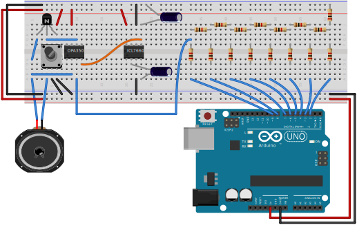

# MusicMakerDocumentation
Documentation and circuit prototypes for the Arduino music class.

The circuit schematics included in this repo will allow students
to create a "Music Player". This music player will accept sound 
stored in 8-bit samples and play it through a speaker at 26kHz. 
The ability to play audio samples will allow for 
flexability in the instruments students make.

### The Schematic

#### Example Breadboard Wiring

### List of Parts (for a single "Music Player")
 - 2 10uF Electrolytic Capacitors
 - 1 ICL7660 (Generates -5V for Op-Amp)
 - 9 2kΩ Resistors
 - 7 1kΩ Resistors (Might include 1 extra eventually).
 - 1 PN2222A or equivilant NPN Transistor
 - 1 OPA350 Op-Amp
 - 1 Speaker (I got these ones from [here](https://www.amazon.com/Yootop-Internal-Magnet-Loudspeaker-Speaker/dp/B07FMR5JGX/ref=sr_1_4?dchild=1&keywords=arduino+speaker&qid=1598312315&sr=8-4)).
   Note these can't play lower frequencies, so if a student wants to make a Bass-Like instrument they will need something different.
 - 1 Potentiometer (Still working on choosing specific type).
 
### Arduino Library for Playing Sounds
The library linked below has been written to allow students to play sounds on the Arduino without having
to worry about implementing heavily optimized hardware timers for the Arduino. It has already been added
to the Arduino IDE Library Manager, and can therefore be installed directly from the Arduino IDE.

[https://github.com/isaacrobinson2000/SoundPlayer.git](https://github.com/isaacrobinson2000/SoundPlayer.git)
 
